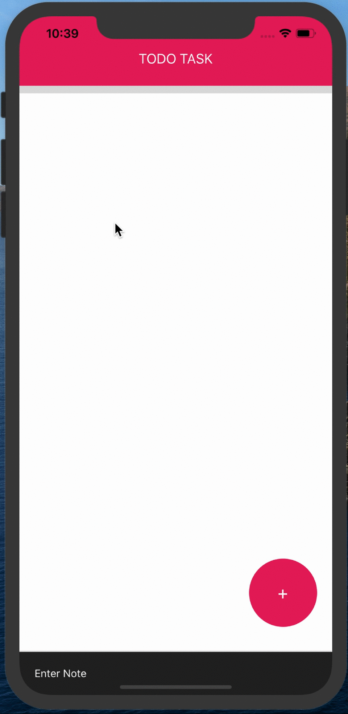

# RN-To-Do-App
Simple to do app using react Native

## This app it's created using Expo
## Libraries/Tools used in the project
- React Native / Expo
- NativeBase Components

## Required steps to start the App: 
### 1 ) In order to start the app these are the requirements

#### node version v10.16.1
#### yarn version 1.17.3 or npm verison 6.10.0
#### `yarn global add expo-cli`
#### or
#### `npm install -g expo-cli`

### Expo client on your
Android: https://play.google.com/store/apps/details?id=host.exp.exponent

iPhone: 
https://apps.apple.com/us/app/expo-client/id982107779

### 2) Final step it's to install all the dependencies by going to the Root Directory of the project and run the commands below:
#### `npm install`
#### `npm start`
#### New tab on your browser will open instantly,scan the QR Code using your phone camera, and open it using the Expo Client.

